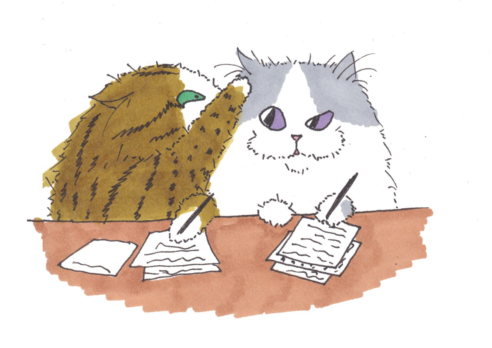
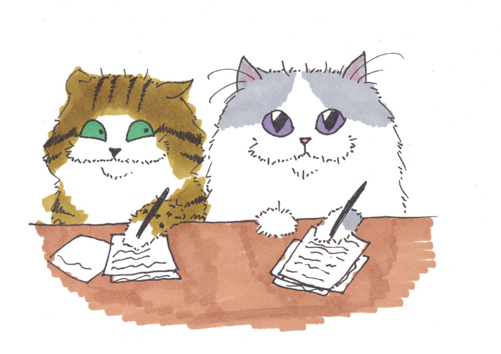
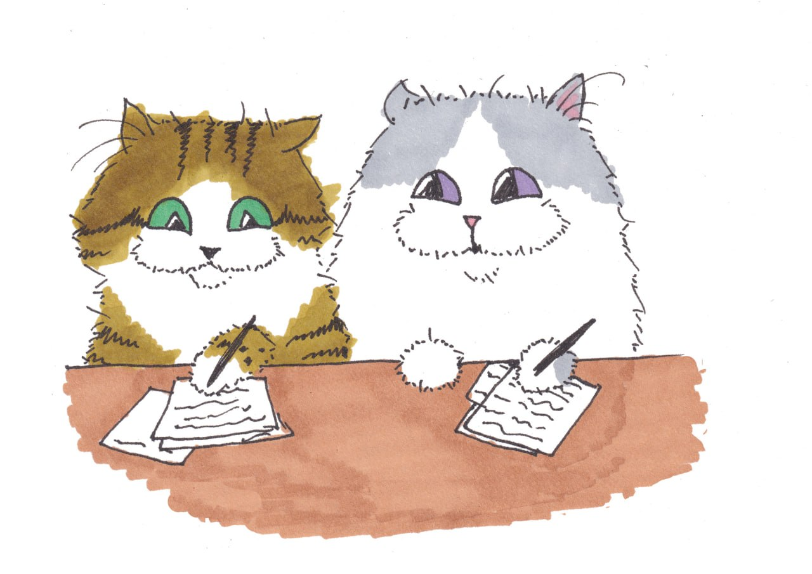
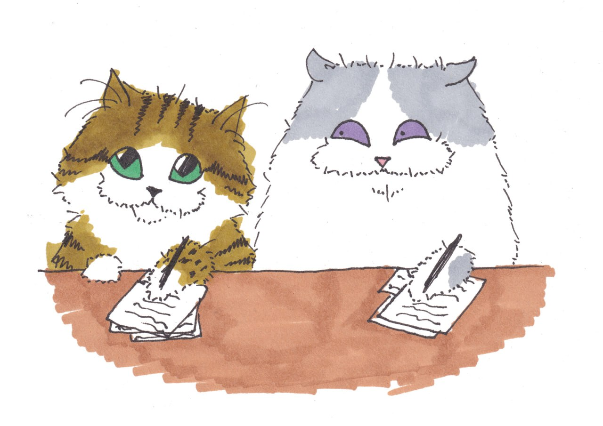
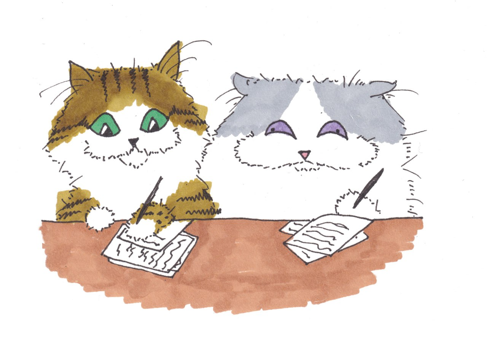
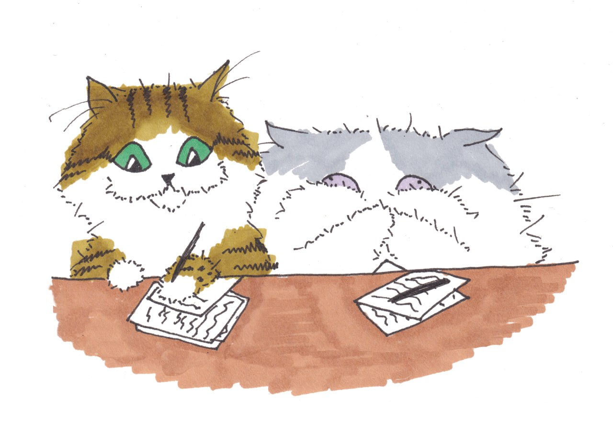
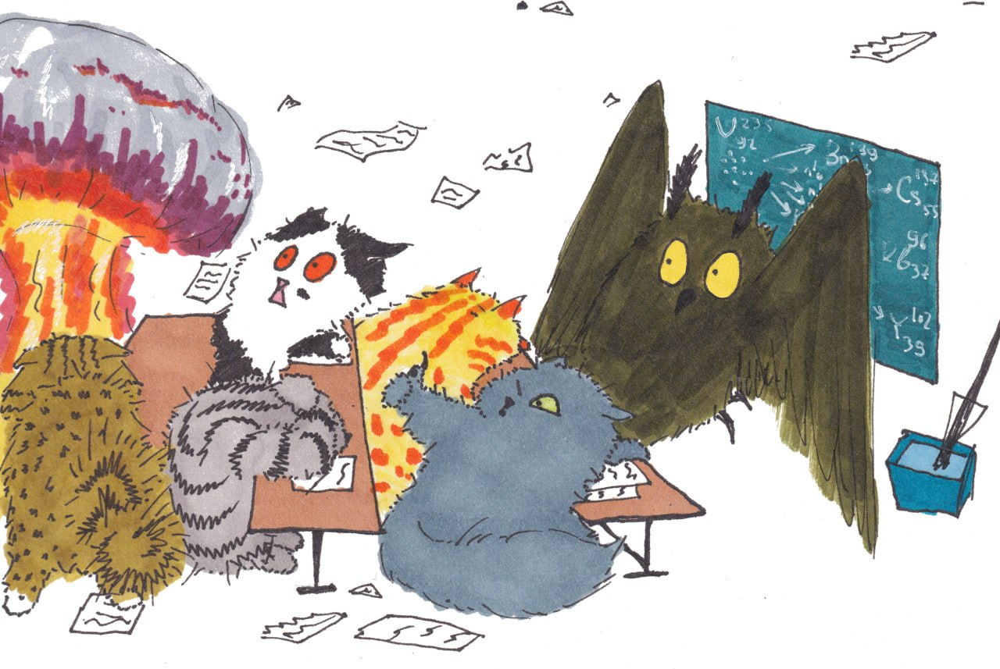

# Лабораторная работа №1

> Изучение системы контроля версий **Git** и хостинга репозиториев **GitHub**

feat. - *https://t.me/this_neural_network/2058*

▶

▶

▶

▶

▶

▶

▶

## 👤 Об авторе

| | |
|---|---|
| **ФИО** | Кравченко Иван Антонович |
| **Группа** | 6402-010302D |
| **Направление** | Прикладная математика и информатика |
| **Научный руководитель** | Головашкин Димитрий Львович |
| **Предполагаемая тема ВКР** | Исследование методов распознавания документов с применением языковых моделей |

## 💬 Любимая цитата

> «Мы люди взрослые, поэтому машинки представлять не будем. Будем представлять паровозики!».
>
> — *Головашкин Димитрий Львович, «Основы параллельных вычислений»*

## 🛠 Что сделано в ЛР №1

- [x] Создан публичный репозиторий `web6402-kravchenko_ia`
- [x] Приглашён лектор `teach-kirshdv`
- [x] Создана ветка `lab1`
- [x] Добавлен `Readme.md` с информацией об авторе
- [x] Ветка `lab1` слита с `main` через Pull Request